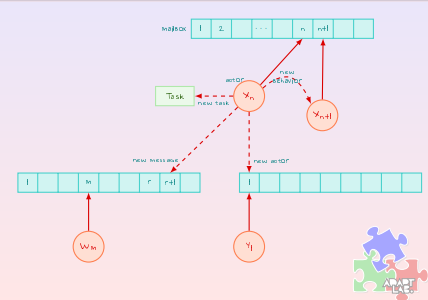

### Gruppo:
+ [Luca Carone Polettini](https://github.com/lochy54)
### Link Utili:
+ [imparare ocaml in y minuti](https://learnxinyminutes.com/docs/ocaml/)
+ [100 esercizi ottimi per ocaml](https://ocaml.org/exercises)
+ [imparare ocaml in y minuti in greco](https://learnxinyminutes.com/docs/el-gr/ocaml-gr/)
# I LINGUAGGI FUNZIONALI
## Cosa è un linguaggio di programmazione funzionale?
Nei linguaggi di programmazione a paradigma funzionale, il focus principale è sulle funzioni. Le funzioni sono considerate oggetti di prima classe e vengono pensate come funzioni matematiche. Questa visione permette di creare funzioni ben definite che non generano effetti collaterali *(side-effects)*, un aspetto cruciale nei linguaggi funzionali puri.
### In generale
+ La ricorsione è usata come struttura di controllo primaria. In alcuni linguaggi, non esiste nessun altro costrutto di loop.
+ In questi linguaggi gli stati sono considerati immutabili.
+ I linguaggi funzionali puri evitano gli effetti collaterali, questo scoraggia l'uso di istruzioni a favore delle valutazioni di espressioni.
## Perché scegliere un linguaggio funzionale?
+ **Codice più veloce**: Ottimizzato per esecuzione rapida.
+ **Facile sviluppo e debug**: Il codice è meno soggetto a bug.
+ **Dimostrazione delle proprietà formali**: Semplice da verificare grazie alla natura matematica delle funzioni.
## Idea di base
L'idea centrale è modellare tutto come una funzione matematica. Ci sono solo due costruttori linguistici:
+ **Astrazione**: definire una funzione.
+ **Applicazione**: chiamare una funzione.
## Concetto di "No State"
+ Non esiste l'assegnazione.
+ Le variabili sono solo nomi.

**ES:** in $f(x) = x + 1$ il nome $f$ è inrilevante e può essere cambiato con $g(x)$.
## Le λ-expressions
1. Se $x$ è una variabile o una constante allora $x$ è una λ-expression.
2. Se $x$ è una variabile e $M$ è una λ-expression allora $λx.M$ è una λ-expression.
3. Se $M$, $N$ sono λ-expressions allora $(MN)$ è una λ-expression.
### Abstraction & Application
+ $λx.x + 1$ **ABSTRACITON** *definisce il successore*
+ $(λx.x + 1) \times 7$ **APPLICATION** *calcola il successore*
# OCaML
E' una implementazione di **ML** ma con funzionalità extra. OCaML contiene:
+ **interpreter** *(ocaml)*
+ **compiler** *(ocamlc)*

Le funzioni sono definite indipendentemente dal loro nome.
```ml
let succ = fun x -> x+1;;
let succ x = x+1;;
```
Le funzioni possono avere un alias.
```ml
let succ' = succ;;
```
Le chiamate sono un applicazione degli elementi di una funzione
```ml
succ 2;;
(fun x -> x+1) 2;;
```
## Scoping
Se uso un bind a un nome il vecchio valore viene nascosto
```ml
let y = 5;;
let y = 10;;
``` 
## In ML le funzioni sono first class citizens
Possono essere usate come valori e passate a funzioni più alte
```ml
let compose f g x = f (g x);;
let compose' (f, g) x = f (g x);;
```

## Parole chiave: "in" e "and"
In ocaml sono presenti due parole chiave molto potenti:
+ "in" permette di definire consecutivamente più funzioni o ridenominazioni di funzioni/valori/costanti che verranno poi usate con quel nome nelle funzioni dalla più esterna alla più interna. Permette di identare meglio le chiamate annidate e di definire non esternamente tali funzioni.
+ "and" permette la dichiarazione multipla di funzioni senza dover utilizzare let e senza dover usare il costrutto in

## Il pattern matching
Il pattern matching è un metodo per confrontare un elemento con un possibile pattern e restituire un risultato.I pattern possono contenere:
+ Un **catchall pattern** che confronta tutti i valori *(_)*.
+ Un **sub-patterns** contenente alternative *(pat1 |pat2)*
```ml
let invert x =
  match x with
  | true -> false
  | false -> true ;;
```
### Quando ho un matche
+ La corrispondente espressione è ritornata.
+ La *(optional)* clausola **when** fa da "guardia" al maching, filtrando le richieste indesiderate

In generale nei paradigmi funzionali è sempre meglio usare un pattern matcher rispetto ai costrutti if-else.

## Funzioni ricorsive
Una funzione è ricorsiva se chiama se stessa. Es: **Fattoriale**

$
5! = 5 \times 4 \times 3 \times 2 \times 1
$

$
5! = 5 \times 4! 
$

$
4! = 4 \times 3!
$

   $
   n! = 
   \begin{cases} 
   1 & \text{if } n = 0 \\
   n \times (n-1)! & \text{if } n > 0 
   \end{cases}
   $

Esempio di funzione ricorsiva in OCaml:
```ml
let rec fact n = if n <= 1 then 1 else n * fact (n - 1);;
```

Una chiamata ricorsiva può essere:
+ **Diretta**: una funzione chiama se stessa
+ **Indiretta** una funzione chiama un altra funzione che chiama la funzione principale

In generale le funzioni ricorsive sono più facili da comprendere e in alcuni casi ho problemi che sono nativamente ricorsivi.
### Tail Recursion

Il problema principale della ricorsione è la creazione di molti frame di memoria. La soluzione di OCaml è la tail recursion, che permette di ottimizzare la gestione della ricorsione senza creare nuovi frame.

## Datatype
ML è **fortemente** e **staticamente tippato** con inferenza di tipo automatica.

+ **Fortemente**  : inserire un tipo errato causa un errore.
+ **Staticamente** : inserire un tipo errato causa un errore.

Dato che è fortemete tippato non posso avere problemi sui tipi.
Poichè non è presente la **coercion**, ho un simbolo diverso per ogni operazione con tipi di dato differente.

### Operatori
+ Costanti: `true` , `false`
+ Operatori razzionali: `==`, `<>`, `< >`, `<=`, `>=`
+ Operatori logici: `&&`, `||`, `not`

Gli operatori possono anche essere creati manualmente, un po' come avviene su c, andandoli a definire come funzioni che eseguono un determinato calcolo. Essendo tutto una funzione in questo paradigma, esso è ampiamente fattibile
```ml
let (>:) a b = (snd a) - (snd b);;
let max a b = if (a >: b >= 0) then a else b
```
Come funziona? Definisco un nuovo operatore infisso, ovvero che vuole un valore posto davanti e uno posto dietro, inserendolo all'interno delle parentesi per identificarlo come operatore. A lui assegno una funzione, che userà dunque i parametri richiesti. Per chiamarlo non basterà altro che porlo al centro dei due parametri che vogliamo passargli, come nella seconda riga 

### Stringhe
Le stringhe sono native in OCaML e sono immutabili se non attraverso la trasformaizone in `byte` e l'uso della funzione set.
+ Concatenation operator `^`
+ Positional access `.[n]`
+ Esiste un modulo **String** con degli operatori
```ocaml
let greeting = "Ciao";;
```
### List
Le liste sono sequenze di elementi omogenei con un proprio costruttore **(chiamato con `::`)** pensate per farci pattern matching sopra.
+ Concatenation operator `@` *(inefficente, conviene fare un aggiunta in testa e poi invertire la lista)*
+ Create con `[]`
+ Esiste un modulo **List** con degli operatori
```ml
let my_list = [1; 2; 3];;
```
## Tuples
Liste di tipi eterogenei con lunghezza fissa. Sono più efficenti di una lista.
+ Create con `()`
+ L'accesso avviene con il pattern matching
```ml
let my_tuple = (1, "hello", true);;
```
## Arrays
Liste di tipi omogenei con acesso diretto tramite indice.
+ create con `[||]`
+ Selezione con `.(indice)`, assegnazione con `.(indice) <- valore`
+ Esiste il modulo **Array** con più operazioni.
```ml
let my_array = [| 1; 2; 3 |];;
my_array.(0) <- 10;;
```
## Record
Sono coppie chiave valore, nativamente immutabili ma che permettono di aggiungere **mutable** alle singole coppie per renderle **mutabile**.
+ Accessibile con un nome
+ Eterogene
+ Creo un record usando type per poi definirlo come nuovo tipo
```ml
type person = { name : string; mutable age : int; }
let p = {name = "Walter"; age = 35} ;;
```
### Aliasing
In OCaml, possiamo creare degli alias per i tipi utilizzando la parola chiave type. Gli alias di tipo sono una forma di abbreviazione che ci permette di dare un nome più descrittivo a tipi esistenti o a combinazioni di tipi, rendendo il codice più leggibile e comprensibile.
```ml
type int_pair = int * int;;
```
In questo esempio, stiamo creando un alias di tipo chiamato int_pair per rappresentare una coppia di numeri interi.


### Varianti
Un **tipo variante** è un tipo che può contenere diverse varianti, ognuna delle quali può avere una struttura differente. Questo tipo è molto utile per definire insiemi di valori con proprietà diverse.
```ocaml
type int_option = Nothing | AnInteger of int ;;
```
In questo esempio, `int_option` è un tipo variante che può assumere due valori:

+ Nothing che rappresenta l'assenza di un valore.
+ AnInteger of int che rappresenta un intero.

### Utilizzo nel Pattern Matching
```ml
type card = Card of regular | Joker
and regular = { suit : card_suit; name : card_name; }
and card_suit = Heart | Club | Spade | Diamond
and card_name = Ace | King | Queen | Jack | Simple of int;;

let value = function
  | Joker -> 0
  | Card {name = Ace} -> 11
  | Card {name = King} -> 10
  | Card {name = Queen} -> 9
  | Card {name = Jack} -> 8
  | Card {name = Simple n} -> n;;
```
## Moduli
I **moduli** in OCaml sono utilizzati per creare datatype e collezioni di funzioni, aiutando a strutturare e organizzare il codice. Sono composti da due parti principali:

1. **Signature**: la parte astratta del modulo, che espone tipi e operatori. Questa sezione descrive cosa è disponibile pubblicamente, ma non come è implementato.
   - Sintassi: `sig ... end`
   
2. **Struct**: la parte concreta del modulo, che contiene l'implementazione effettiva del codice.
   - Sintassi: `struct ... end`

I moduli possono essere astratti per nascondere i dettagli implementativi e mantenere un'interfaccia pulita e facile da usare.
### Perché distinguere funzioni astratte e funzioni concrete?
Separare le funzioni astratte dalle concrete permette di avere diverse implementazioni per uno stesso concetto, consentendo di scegliere quella più adatta alle proprie esigenze senza cambiare l'interfaccia esterna.
Questa separazione è utile anche per organizzare grandi implementazioni suddividendo il codice in piccoli moduli facilmente gestibili.

```ml
module PrioQueue =
  struct
    type priority = int
    type char_queue = Empty | Node of priority * char * char_queue * char_queue
    exception QueueIsEmpty

    let empty = Empty

    let rec insert queue prio elt =
      match queue with
      Empty -> Node(prio, elt, Empty, Empty)
      | Node(p, e, left, right) ->
        if prio <= p
        then Node(prio, elt, insert right p e, left)
        else Node(p, e, insert right prio elt, left)
    
    let rec remove_top = function
      Empty -> raise QueueIsEmpty
      | Node(prio, elt, left, Empty) -> left
      | Node(prio, elt, Empty, right) -> right
      | Node(prio, elt, (Node(lprio, lelt, _, _) as left),
      (Node(rprio, relt, _, _) as right)) ->
        if lprio <= rprio
        then Node(lprio, lelt, remove_top left, right)
        else Node(rprio, relt, left, remove_top right)
    
    let extract = function
      Empty -> raise QueueIsEmpty
      |Node(prio, elt, _, _) as queue -> (prio, elt, remove_top queue)
  end;;
```

L'inrefaccia di un modulo può essere compilata separatamente
## Functors
I **Functors** in OCaml sono funzioni che operano su moduli e producono altri moduli. In altre parole, un Functor è una funzione da una struttura di dati a un'altra. Questo significa che:
+ La firma delle strutture di input e output è fissata.
+ I dettagli implementativi possono variare senza influire sui moduli che li utilizzano.

I Functors consentono di evitare la duplicazione del codice e migliorano l'ortogonalità all'interno di un pacchetto **type-safe**.

### Esempio implementativo
Supponiamo di voler implementare una funzione `is_balanced()` che controlli se una stringa ha parentesi bilanciate:
```ml
let is_balanced str =
  let s = Stack.empty in
  try
    String.iter
      (fun c -> match c with
         | '(' -> Stack.push s c
         | ')' -> Stack.pop s
         | _ -> ()) str;
    Stack.is_empty s
  with Stack.EmptyStackException -> false
```
### Modulo di Stack
Definiamo un modulo che descriva la struttura di uno stack, che useremo con il nostro algoritmo:
```ml
module type StackADT =
sig
  type char_stack
  exception EmptyStackException
  val empty : char_stack
  val push : char_stack -> char -> unit
  val top : char_stack -> char
  val pop : char_stack -> unit
  val is_empty : char_stack -> bool
end
```
In questo modulo, se l'algoritmo termina con uno stack vuoto, allora la stringa è bilanciata.
### Matcher factor
Il Matcher collega il nostro algoritmo a uno stack astratto di tipo dato:

```ml
module Matcher (Stack : StackADT) =
struct
  let is_balanced str =
    let s = Stack.empty in
    try
      String.iter
        (fun c -> match c with
           | '(' -> Stack.push s c
           | ')' -> Stack.pop s
           | _ -> ()) str;
      Stack.is_empty s
    with Stack.EmptyStackException -> false
end
```
Questo **Functor Matcher** permette di utilizzare qualsiasi implementazione dello stack purché segua la struttura definita in `StackADT`.
## Polymorphism in ML
Il polimorfismo consente di scrivere funzioni e strutture dati generiche che possono operare su diversi tipi di dato utilizzando un'interfaccia comune.
### Esistono diversi tipi di polimorfismo

+ **Polimorfismo parametrico**: Consente di scrivere funzioni senza menzionare specificamente alcun tipo di dato.
```ml
let compose f g x = f (g x);;
```
Questo significa che la funzione può operare su qualsiasi tipo, purché i tipi si adattino.

+ **Polimorfismo ad hoc** (Overloading): Le funzioni hanno diverse implementazioni che dipendono dalla combinazione e dal tipo di dati.
+ **Polimorfismo di sottotipo**: Le funzioni possono operare su un insieme ristretto di tipi che appartengono a una gerarchia di sottotipi. È un caso particolare di polimorfismo parametrico.


### Polimorfismo parametrico in OCaml
OCaml supporta pienamente il polimorfismo parametrico, che consente di implementare funzioni generiche senza vincolare esplicitamente i tipi. Un esempio tipico è la funzione `compose`:
```ml
let compose f g x = f (g x);;
```
### Compose è un weak-typed
Quando non conosciamo esattamente il tipo di una funzione, questa viene considerata **weakly-typed**. I tipi verranno ristretti alle possibili combinazioni di tipi della funzione e successivamente risolti nel primo tipo disponibile.
```ml
# let compose f g x = f (g x);;
val compose : ('a -> 'b) -> ('c -> 'a) -> 'c -> 'b = <fun>

# let compose' = compose (fun c -> int_of_char c) ;;
val compose' : ('_a -> char) -> '_a -> int = <fun>
```
In questo esempio, il simbolo `_` viene utilizzato per indicare che il tipo è stato inizializzato come **weakly-typed**, e sarà risolto successivamente quando verrà utilizzato con un tipo specifico.

In una funzione weakly-typed il suo tipo non è completamente definito fino a quando non viene utilizzata. Questo tipo verrà ristretto a seconda dei tipi specifici passati alla funzione durante l'esecuzione.
Una volata associato un tipo quello sarà permanente.
## Currying
Currying è una tecnica utilizzata per trasformare una funzione che prende più argomenti in una serie di funzioni che prendono un singolo argomento. Questo permette di "parzializzare" una funzione, cioè di fornire un argomento alla volta.

$f(x,y)= y/x \rightarrow f(2)= y/2 \rightarrow f(2)(3) = 3/2 $
Posso scriverlo come 
$f(x,y)= y/x \rightarrow g(2)= f(2,y)=y/2 \rightarrow g(3) = 3/2 $

In pratica, la funzione viene trasformata in una serie di funzioni che prendono un argomento alla volta.
```ml
let f x y = y /. x ;;  (* Definizione di una funzione con due argomenti *)
let g = f 2. ;;        (* Applicazione parziale della funzione f con x = 2 *)
```
### Usando parametri nominali
In OCaml, possiamo anche definire funzioni utilizzando parametri nominali, che ci permettono di esplicitare i nomi dei parametri quando si chiama la funzione:
```ml
let compose ~f ~g x = f (g x) ;;  (* Funzione con parametri nominali *)
let compose' = compose ~g:(fun x -> x ** 3.) ;;  (* Applicazione parziale *)
```  
Il **Currying** è utile quando sappiamo che uno dei parametri della nostra funzione è fissato o quando non abbiamo tutti gli argomenti disponibili contemporaneamente.
## Pattern Map, filter and reduce
Pattern sono fondamentale nella programmazione funzionale:
+ Applica una funzione su tutti gli elementi del mio argomento **map**
```ml
let rec map f = function
h::l1 -> f h::map f l1
| _ -> [];;
```

+ Filtrare degli elementi del mio argomento **filter**
```ml
let rec filter p = function
[] -> []
| h::l -> if p h then h :: filter p l else filter p l
```

+ Riduce gli elementi ad un singolo valore **reduce**
```ml
let rec reduce acc op = function
[] -> acc
| h::tl -> reduce (op acc h) op tl ;;
```

### Altri pattern definiti usando map e reduce
Possiamo definire altri pattern utili usando `map` e `reduce`, come ad esempio: 
+ **exist**: Ritorna `true` se almeno un elemento della lista soddisfa il predicato.
```ml
let exists p l = reduce false (||) (map p l);
```
+ **forall**: Ritorna `true` se tutti gli elementi della lista soddisfano il predicato.
```ml
let forall p l = reduce true (&&) (map p l);;
```
## Folding
Nella programmazione funzionale, il folding è il processo di ridurre una lista (o un'altra struttura di dati) a un singolo valore iterando attraverso di essa e combinando i suoi elementi usando una funzione binaria. Esistono due tipi principali di fold:
+ **Fold sinistro** (fold_left): Questa operazione combina gli elementi da sinistra a destra. Inizia con il primo elemento della lista e lo combina con i risultati della combinazione ricorsiva degli altri elementi. 
  + $((((((0 + 1) + 2) + 3) + 7) + 25) + 4)$

+ **Fold destro** (fold_right): Questa operazione funziona in modo opposto, combinando gli elementi della lista da destra a sinistra. Inizia dall'ultimo elemento della lista e lo combina con i risultati della combinazione ricorsiva degli altri elementi.
  + $0 + (1 + (2 + (3 + (7 + (25 + 4)))))$

Se una funzione non ha una base matematica il folding lo definisco io con fold_left o fold_right.
```ml
let l = [1.;2.;3.;4.;5.] ;;
List.fold_right (/.) l 1. ;;
List.fold_left (/.) 1. l ;;
```
## Funzioni con Numero Variabile di Argomenti
 Implementazione di base che permette di accumulare i valori passati come argomenti utilizzando una funzione chiamata arg che accetta due valori e una funzione finale che elabora il risultato:
 ```ml
let arg x = fun y rest -> rest (op x y) ;;
let stop x = x;;
let f g = g init;;
 ```
Questa struttura è flessibile e permette di eseguire operazioni in modo iterativo:
```ml
f (arg 1) (arg 2) (arg 7) stop;;
```
### Utilizzo di Functor per la Generalizzazione
Per superare le limitazioni della definizione di funzioni con argomenti variabili, viene introdotto un functor, che permette di creare moduli flessibili e riutilizzabili per diverse operazioni.

```ml
module type OpVarADT =
sig
type a and b and c
val op: a -> b -> c
val init : c
end

module VarArgs (OP : OpVarADT.OpVarADT) =
struct
let arg x = fun y rest -> rest (OP.op x y) ;;
let stop x = x;;
let f g = g OP.init;;
end
```
### Problema
Un tipo generico come 'a list non può corrispondere alla firma OpVarADT perché nessuno dei tipi è definito come parametrico.
### Soluzione Astrazione
```ml
module ListConcat = struct
type a and b = a list and c = a list
let op = fun (x: a) y -> y @ [x] ;;
let ini
```
Facendo così ritorno una struttura e non un tipo.

# Erlang
Erlang nasce nel 1987 presso il laboratorio CS di Ericsson, con l'obiettivo di trovare un paradigma adatto alle telecomunicazioni.
- Erlang è orientato alla concorrenza e utilizza il modello ad attori, con scambio di messaggi asincroni e memoria non condivisa. L'idea è che siamo tutti in grado di mandare e ricevere messaggi asincroni , il modello più simile è quello della posta elettronica.

- Erlang è un linguaggio funzionale, dinamicamente tipizzato, che supporta:
  - distribution
  - fault tolerance 
  - hot-swapping

- Perchè funzinale $ \rightarrow $ perchè non ha stato, se io scorro tutte le instruzioni arrivo sempre allo stesso stato.
## Primo Esempio
```erl
-module(fact).
-export([fact/1]).
fact(0) -> 1;
fact(N) -> N*fact(N-1).
```
Una volta che un modulo è compilato con **"c"** sarà dentro la vm di erlang e sarà utilizzabile.
In alternativa posso generare uno script tramite **hipe**.
La sezione **Programmazione Sequenziale in Erlang** descrive come utilizzare il linguaggio per creare programmi lineari e gestire dati, variabili, funzioni, e altro ancora. Di seguito una spiegazione più dettagliata con ulteriori informazioni:

## **Tipi di Dati**
Erlang supporta diversi tipi di dati fondamentali:

- **Numeri**: possono essere interi (ad es., `10`, `16#FF` per un numero in base 16) o numeri in virgola mobile (`-12.35e-2`).
- **Atomi**: simili alle costanti, iniziano con una lettera minuscola (`hello`, `true`) o possono essere racchiusi tra apici (`'Nome'`). Gli atomi rappresentano valori simbolici.
- **Tuple**: strutture che memorizzano un numero fisso di elementi. Ad esempio, `{123, "walter", cazzola}` è una tupla contenente tre elementi di tipi diversi.
  - Le tuple fanno confrotti strutturali.

      ```erlang
      {{1, 2}, 3}=={1, {2, 3}}.
      false
      ```
- **Liste**: collezioni dinamiche di elementi. Ad esempio, `[1, 2, 3]` o `["ciao", 10, true]`. Le liste possono crescere o ridursi durante l'esecuzione del programma.

## **Assegnazioni e Pattern Matching**
In Erlang, le assegnazioni non sono variabili mutevoli ma **associazioni** di nomi a valori:

- **Assegnazione**: `A = 10` associa il valore `10` alla variabile `A`. Una volta assegnata, `A` non può essere riassegnata a un valore diverso.
- **Pattern Matching**: tecnica centrale in Erlang per associare valori a variabili in base a uno schema. Ad esempio, `[H|T] = [1, 2, 3]` associa `1` a `H` (la testa della lista) e `[2, 3]` a `T` (la coda della lista). Il pattern matching può essere utilizzato anche per confrontare strutture complesse, come tuple.

## **Funzioni e Moduli**
Erlang utilizza un modello modulare per organizzare il codice. Un modulo è un contenitore di funzioni:
```erlang
-module(ex_module).
-export([double/1]).
double(X) -> double(X, 2).
double(X, N) -> X * N.
```
- double/1 può essere chiamata da fuori modulo
- double/2 è locale

### Definizione di funzioni
 si utilizzano pattern per i parametri, e ogni funzione può avere più clausole definite attraverso il pattern matching. Le clausole vengono esaminate sequenzialmente fino a trovare una corrispondenza. Ad esempio:
  
  ```erlang
  -module(fact).
  -export([fact/1]).

  fact(0) -> 1;
  fact(N) -> N * fact(N - 1).
  ```

  In questo esempio, `fact/1` è una funzione ricorsiva per calcolare il fattoriale di un numero.

### Guardie
Una clausola può essere ulteriormente limitata con condizioni (guardie). Ad esempio, una funzione può avere:
  
  ```erlang
  is_even(N) when N rem 2 == 0 -> true;
  is_even(_) -> false.
  ```

  Qui, `when N rem 2 == 0` è una guardia che verifica se `N` è pari.

Gli operatori cortocircuitali (lazy evaluation) vanno specificati : `andalso` `orelse`.

###   Comprensioni di Liste
Erlang offre le **list comprehensions** per creare liste in modo compatto utilizzando generatori e filtri:

- La sintassi base è `[Espressione || Qualificatore1, ..., Qualificatoren]`.
- I qualificatori possono essere **generatori** (`Pattern <- Lista`) o **filtri** (condizioni booleane).

Ad esempio, per filtrare numeri primi:
  
```erlang
primes(N) when N > 1 -> [X || X <- lists:seq(2, N), 
                            (length([Y || Y <- lists:seq(2, trunc(math:sqrt(X))), 
                            ((X rem Y) == 0)]) == 0)];
primes(_) -> [].
```

In questo caso, si genera una lista di numeri primi fino a `N`.

## Thread
Il programma è suddiviso in task che vengono eseguite contemporaneamente. Queste task operano su una memoria condivisa, il che può causare diversi problemi:
- **Race condition con perdita di aggiornamenti**: ad esempio, se due thread tentano di eseguire un'operazione sul bilancio di un conto simultaneamente, può verificarsi una situazione di race condition.
- **Deadlock**: può accadere quando due processi cercano di bloccare risorse in un ordine opposto, bloccandosi a vicenda.

Erlang (e anche Scala tramite la libreria Akka) adotta un approccio diverso alla concorrenza: il **Modello Actor**.
## Modello Actor
Nel modello Actor, ogni oggetto è un **attore**:

- Dispone di una **mailbox** per l'invio e la recezione di messaggi.
- Possiede un **comportamento** specifico.
- Gli attori comunicano tra loro esclusivamente tramite **messaggi**.

Quando un attore riceve un messaggio, può svolgere diverse azioni:
1. **Inviare messaggi** ad altri attori.
2. **Creare nuovi attori** per distribuire il lavoro.
3. **Modificare il proprio comportamento** per gestire diversamente i successivi messaggi che arriveranno nella mailbox.

### Alcuni aspetti chiave del modello Actor:
- Tutte le comunicazioni sono **asincrone**
- Non c’è condivisione diretta dello **stato** tra gli attori
- L’accesso allo stato interno di un attore avviene tramite messaggi

Gli attori sono eseguiti in parallelo e implementati come **thread leggeri in user-space** (spazio utente), rendendo il modello altamente efficiente e scalabile per applicazioni concorrenti e distribuite.



### La concorrenza nel modello Actor si basa su tre elementi fondamentali
1. **Funzione `spawn()`**: permette di creare nuovi attori.
2. **Operatore `!`**: invia messaggi ad altri attori.
3. **Pattern matching**: sui messaggi nella mailbox

## GLi attori
Ogni attore è caratterizzato da:

- **un indirizzo** che lo identifica in modo univoco.
- **una mailbox** che memorizza i messaggi ricevuti ma non ancora elaborati.

I messaggi nella mailbox sono ordinati in base al tempo di arrivo, non a quello di invio.

Per inviare un messaggio a un attore è necessario conoscere l'indirizzo (PID) dell'attore destinatario. E' utile anche includere il proprio indirizzo (PID) nel messaggio, nel caso si desideri una risposta;
```erlang
Exp1 ! Exp2
```
- **Exp1** deve identificare un attore (il destinatario).
- **Exp2** può essere qualunque espressione valida in Erlang; il valore dell'invio corrisponde al risultato di **Exp2**.
  
Caratteristiche dell'invio dei messaggi:
- L'invio **non fallisce** anche se l'attore destinatario non esiste o non è raggiungibile.
- L'operazione di invio è **non bloccante**: il mittente non attende mai la ricezione del messaggio.

Questi aspetti rendono la comunicazione tra attori affidabile e adatta alla concorrenza asincrona.
## Recezione
L'operazione di ricezione nei modelli Actor utilizza il **pattern matching** per gestire i messaggi.

```erlang
receive
  Any -> do_something(Any)
end
```
- L'attore estrae dalla mailbox il messaggio più vecchio che corrisponde al pattern `Any`.
- Se la mailbox è vuota, l'attore resta bloccato in attesa di un messaggio.

Esempio di ricezione con pattern specifico:
```erlang
receive
  {Pid, something} -> do_something(Pid)
end
```
- L'attore cerca di estrarre il messaggio più vecchio che corrisponde al pattern `{Pid, something}`.
- Se non trova un messaggio corrispondente, resta bloccato finché un messaggio conforme non viene ricevuto.

Ricezione con pattern multipli e condizioni aggiuntive (guardie):
```erlang
receive
  Pattern1 [when GuardSeq1] -> Body1;
  ...
  Patternn [when GuardSeqn] -> Bodyn
  [after Exprt -> Bodyt]
end
```
- Se nessun pattern corrisponde ai messaggi nella mailbox, l’attore resta in attesa senza sollevare eccezioni.
- Per evitare attese indefinite, si può utilizzare la clausola `after`: dopo **Exprt** millisecondi, l'attore viene risvegliato e esegue `Bodyt`.
## PID pubblico
Erlang offre un meccanismo per rendere pubblico il **PID** (Process Identifier) di un processo a tutti gli altri processi.

- `register(an_atom, Pid)`: registra un PID associandolo a un atomo, rendendo il processo accessibile tramite il nome.
- `unregister(an_atom)`: dissocia l'atomo dal PID registrato.
- `whereis(an_atom) -> Pid | undefined`: restituisce il PID del processo associato all'atomo, oppure `undefined` se non esiste.
- `registered()`: restituisce l'elenco di tutti gli atomi registrati.

Una volta registrato, è possibile inviare messaggi direttamente al processo tramite il nome:

```erlang
name ! msg.
```

### Esempio di Implementazione: Modulo `clock`

Di seguito è riportato un esempio di un modulo chiamato `clock`, che utilizza queste funzionalità per gestire un timer:

```erlang
-module(clock).
-export([start/2, stop/0]).

start(Time, Fun) ->
    register(clock, spawn(fun() -> tick(Time, Fun) end)).

stop() ->
    clock ! stop.

tick(Time, Fun) ->
    receive
        stop -> void
    after
        Time -> Fun(), tick(Time, Fun)
    end.
```
## BEAM
Gli attori non sono processi gestiti dal sistema operativo, ma dal **BEAM** (la VM di Erlang) che usa uno **scheduler preemptivo**. Se un attore esegue troppo a lungo o attende messaggi, viene sospeso e messo in coda.
Ecco una rielaborazione del contenuto del file, corretta e ampliata con dettagli per una maggiore chiarezza, e formattata in Markdown.


## Introduzione agli Errori nei Programmi Concorrenziali

Nella programmazione concorrente, quando due processi sono correlati:
- Gli errori in un processo possono influenzare il comportamento dell'altro.
- La funzione BIF `link/1` permette di monitorare i processi collegati.

### Gestione degli Errori con i Segnali di Uscita

Quando un processo **A** è collegato a un processo **B**:
- Se **B** termina, viene inviato a **A** un segnale di uscita nel formato `{'EXIT', Pid, Reason}`.
- Questo segnale contiene informazioni sul motivo della terminazione.


## Funzione di Collegamento e Propagazione degli Errori

La funzione `link/1` definisce un **percorso di propagazione degli errori bidirezzionale**:
- Quando un processo muore, genera un segnale di uscita che viene trasmesso a tutti i processi collegati.
- Se un processo termina naturalmente, il motivo (`Reason`) dell’uscita è **normal**.
- È possibile inviare segnali di uscita espliciti con `exit(Pid, Reason)` per simulare una "morte" senza terminare il mittente.

In Erlang, esistono due tipi di processi quando si tratta di gestire segnali di uscita: **processi normali** e **processi di sistema**.
- Se un processo normale riceve un **segnale di uscita** da un altro processo a cui è collegato (ad esempio, perché quest'ultimo è terminato), **morirà** anche lui, propagando così l'errore. 
- Quando un processo di sistema riceve un segnale di uscita, **non muore automaticamente**; invece, riceve il segnale come un normale messaggio nella propria **casella di posta** (mailbox).
- Questo significa che il processo può scegliere come gestire il segnale, ad esempio loggando l’errore o eseguendo delle azioni di recupero, senza dover terminare.

### Trasformare un Processo in Processo di Sistema
Per trasformare un processo in un **processo di sistema**
è sufficiente usare il comando `process_flag(trap_exit, true)`. Questo comando imposta il processo per **catturare i segnali di uscita** (trap exit), permettendogli di trattare tali segnali come messaggi anziché termini di terminazione.

### Recezione di un processo normale
| `trap_exit` | Segnale di Uscita | Azione del Processo Ricevente |
|-------------|--------------------|-------------------------------|
| `true`      | `kill`            | Il processo **muore** e propaga il segnale di terminazione ai processi collegati. |
| `true`      | `X`               | Il processo **non muore**, ma aggiunge il segnale `{‘EXIT’, Pid, X}` alla sua casella di posta, dove può essere gestito come un normale messaggio. |
| `false`     | `normal`          | Il processo **continua** l’esecuzione e il segnale di uscita viene ignorato (non ha alcun effetto sul processo ricevente). |
| `false`     | `kill`            | Il processo **muore** e propaga il segnale `kill` ai processi collegati. |
| `false`     | `X`               | Il processo **muore** e trasmette il segnale `{‘EXIT’, Pid, X}` ai processi collegati. |


## Strategie di Gestione degli Errori
A seconda delle esigenze, possiamo gestire gli errori in modo flessibile:

1. **Ignorare gli errori**:  
   ```erlang
   Pid = spawn(fun() -> ... end)
   ```
2. **Morire in caso di errore**:  
   ```erlang
   Pid = spawn_link(fun() -> ... end)
   ```
3. **Gestire gli errori esplicitamente**:  
   ```erlang
   process_flag(trap_exit, true),
   Pid = spawn_link(fun() -> ... end)
   ```
## Esempio di Error Handling

Il modulo `edemo1` crea tre processi **A**, **B** e **C**:
- **A** è configurato per catturare i segnali di uscita (`trap_exit` impostato a `true`).
- **B** cattura i segnali di uscita solo se `Bool` è `true`.
- **C** può terminare con diverse ragioni (es. `{die, Reason}` o `{divide, N}`).

```erlang
-module(edemo1).
-export([start/2]).

start(Bool, M) ->
    A = spawn(fun() -> a() end),
    B = spawn(fun() -> b(A, Bool) end),
    C = spawn(fun() -> c(B, M) end),
    sleep(1000), status(b, B), status(c, C).

a() -> process_flag(trap_exit, true), wait(a).
b(A, Bool) -> process_flag(trap_exit, Bool), link(A), wait(b).
c(B, M) ->
    link(B),
    case M of
        {die, Reason} -> exit(Reason);
        {divide, N} -> 1 / N, wait(c);
        normal -> true
    end.
```

### Funzioni di Supporto
Il modulo include funzioni di supporto come `wait/1`, `sleep/1` e `status/2` per gestire e verificare lo stato dei processi.
### Esempi di Esecuzione

- **Esecuzione 1**: `edemo1:start(false, {die, normal})`
    - **C** muore trasmettendo `{normal, ...}`.
    - **B** e **A** continuano a funzionare, **B** ignora il segnale di uscita di **C**.

- **Esecuzione 2**: `edemo1:start(false, {divide, 0})`
    - **C** muore trasmettendo `{badarith, ...}`.
    - **B** muore perchè il messeaggio non è normal

## Monitor: Collegamenti Asimmetrici

I **monitor** sono collegamenti unidirezionali:
- Se un processo **A** monitora un processo **B**, e **B** termina, a **A** viene inviato un messaggio `DOWN`.
- Al contrario, se **A** muore, **B** non riceve alcun segnale.

```erlang
Ref = erlang:monitor(process, Pid)
```


## La programmazione distribuita 
Offre numerosi vantaggi:
- **Performance**
- **Affidabilità**
- **Scalabilità**
- **Applicazioni Distribuite**

### Modelli di Distribuzione in Erlang
1. **Erlang Distribuito**: Permette di eseguire applicazioni su nodi Erlang fortemente accoppiati, supportando lo spawning di processi su ogni nodo.
2. **Distribuzione basata su Socket**: Ideale per ambienti non fidati, con connessioni limitate e un controllo dettagliato sull’esecuzione di processi.

### Esempio: Name Server 
```erlang
-module(kvs).
-export([start/0, store/2, lookup/1]).

start() -> register(kvs, spawn(fun() -> loop() end)).

store(Key, Value) -> rpc({store, Key, Value}).

lookup(Key) -> rpc({lookup, Key}).

rpc(Q) ->
    kvs ! {self(), Q},
    receive
        {kvs, Reply} -> Reply
    end.

loop() ->
    receive
        {From, {store, Key, Value}} -> 
            put(Key, {ok, Value}), 
            From ! {kvs, true}, 
            loop();
        {From, {lookup, Key}} -> 
            From ! {kvs, get(Key)}, 
            loop()
    end.
```
- `start()`: Avvia il server e lo registra col nome `kvs`.
- `store(Key, Value)`: Salva un valore associato a una chiave.
- `lookup(Key)`: Cerca il valore associato alla chiave.
```shell
1> kvs:start().
true
2> kvs:store({location, walter}, "Genova").
true
3> kvs:lookup({location, walter}).
{ok, "Genova"}
4> kvs:lookup({location, cazzola}).
undefined
```
### Esecuzione Distribuita su Localhost
```shell
[sif@surtur] erl -sname sif
(sif@surtur)1> kvs:start().
true
(sif@surtur)2> kvs:lookup(weather).
{ok, sunny}

[amora@surtur] erl -sname amora
(amora@surtur)1> rpc:call(sif@surtur, kvs, store, [weather, sunny]).
true
(amora@surtur)2> rpc:call(sif@surtur, kvs, lookup, [weather]).
{ok, sunny}
```

## Distribution Primitives
Per lavorare con nodi distribuiti, Erlang fornisce una serie di primitivi. Esempio di utilizzo:

- **spawn**: Crea un processo su un nodo specifico.
  
  ```erlang
  Pid = spawn(Node, Module, Function, ArgumentList).
  ```
- **monitor_node**: Monitora un nodo specifico.
  ```erlang
  monitor_node(Node, true).
  ```

## Sistema di Protezione tramite Cookie

Erlang richiede che i nodi abbiano un **cookie identico** per comunicare. Esistono tre metodi principali per impostare il cookie:
1. Tramite `$HOME/.erlang.cookie`.
2. Opzione `-setcookie` durante l'avvio della VM.
3. Utilizzando `erlang:set_cookie` all'interno del programma.

## Il modulo lib_chan
Il modulo **lib_chan** di Erlang fornisce un controllo dettagliato sulla distribuzione dei processi.

### 1. Avviare il Server `lib_chan`
La funzione principale per avviare il server è:
```erlang
start_server() -> true
```
Questa funzione avvia un server sulla macchina locale. La configurazione del server è definita nel file `$HOME/.erlang_config/lib_chan.conf`.

- **Definizione del Servizio**:
  ```erlang
  {service, S, password, P, mfa, SomeMod, SomeFunc, SomeArgs}
  ```
  Ogni servizio definito ha vari parametri:
  - **S**: Nome del servizio.
  - **password, P**: Password per l'accesso. Solo i client con la password corretta possono utilizzare il servizio.
  - **mfa**: Identifica il modulo (`SomeMod`), la funzione (`SomeFunc`) e gli argomenti (`SomeArgs`) da eseguire.

### 3. Connessione a un Servizio

Per collegarsi a un servizio, si utilizza la funzione `connect`:

```erlang
connect(Host, Port, S, P, ArgsC) -> {ok, Pid} | {error, Why}
```

Dove:
- **Host** e **Port**: Specificano l'host e la porta del server.
- **S**: Nome del servizio a cui connettersi.
- **P**: Password richiesta per accedere al servizio.
- **ArgsC**: Argomenti specifici del client che verranno passati alla funzione di servizio.

### Configurazione nel File `.erlang_config/lib_chan.conf`

```erlang
{port, 12340}.
{service, nameServer, password, "ABXy45", mfa, mod_name_server, start_me_up, notUsed}.
```
# Scala
**Caratteristiche principali**:  
- Sintassi succinta ed elegante (riduzione del codice del 50-75%).  
- Supporto per interpreti interattivi e linguaggi specifici di dominio (DSL).  
- Unisce programmazione orientata agli oggetti e funzionale.  

Scala è fortemente tipizzato e offre:  
- Tipi astratti e dipendenti dal contesto.  
- Classi generiche e metodi polimorfici.  
- Inferenza di tipo limitata.  

## Primo programma in Scala 
**Classe:**  
```scala
class Upper {
  def upper(strings: String*): Seq[String] = {
    strings.map(_.toUpperCase())
  }
}

val up = new Upper
Console.println(up.upper("A", "First", "Scala", "Program"))
```
**Oggetto singolo (singleton):**  
```scala
object Upper {
  def upper(strings: String*) = strings.map(_.toUpperCase())
}

println(Upper.upper("A", "First", "Scala", "Program"))
```
- Scala utilizza oggetti invece di metodi statici come in Java.  
- L'underscore (`_`) funge da carattere jolly.  

**Esempio di metodo `main` in un oggetto singolo:**  
```scala
object Upper {
  def main(args: Array[String]) = {
    args.map(_.toUpperCase).foreach(printf("%s ", _))
    println("")
  }
}
```
## Tipi in Scala 
- **Any:** radice della gerarchia dei tipi.  
  - **AnyRef:** radice per i tipi di riferimento (oggetti Java e Scala).  
  - **AnyVal:** radice per i tipi primitivi (es. `Int`, `Double`).  
- **Null:** rappresenta il valore vuoto per i tipi di riferimento.  
- **Nothing:** tipo speciale, usato per rappresentare un'assenza definitiva (ad esempio una lista vuota `List[Nothing]`).  

## Paradigma Orientato agli Oggetti 
- Tutto è un oggetto.  
- Ogni operazione è un metodo.  

Esempio:  
```scala
scala> 1.+(2)
res0: Int = 3
```

## Variabili
- **Immutable:** dichiarate con `val`.  
- **Mutable:** dichiarate con `var`.  

## Case Classes
Scala semplifica la gestione di strutture immutabili con le *case classes*:  
```scala
case object True extends Bool {
  def and(b: => Bool) = b
  def or(b: => Bool) = this
}

case object False extends Bool {
  def and(b: => Bool) = this
  def or(b: => Bool) = b
}
```


## Opzioni: None e Some 
Scala utilizza `Option` per rappresentare valori che potrebbero essere nulli , Esempio:  
```scala
val capitals = Map("Liguria" -> "Genova", "Lombardia" -> "Milano")
println(capitals.get("Liguria").getOrElse("Non trovata"))
```

## Funzioni e Metodi 
Scala supporta funzioni come valori di prima classe:  
```scala
val succ = (x: Int) => x + 1
def succMethod(x: Int) = x + 1
```

Funzioni parametriche:  
```scala
def id[T](x: T): T = x
```


### **Comprensioni e Generatori**  
Strumenti potenti per iterare e costruire nuove collezioni:  
```scala
val sumEvens = (nums: List[Int]) => (for (n <- nums if n % 2 == 0) yield n).sum
```

Scala offre anche funzioni di utilità come `map`, `reduce`, `exists`, e `forall`.  


